Quickstart
==========

Login
-----

First log in using your username and password.

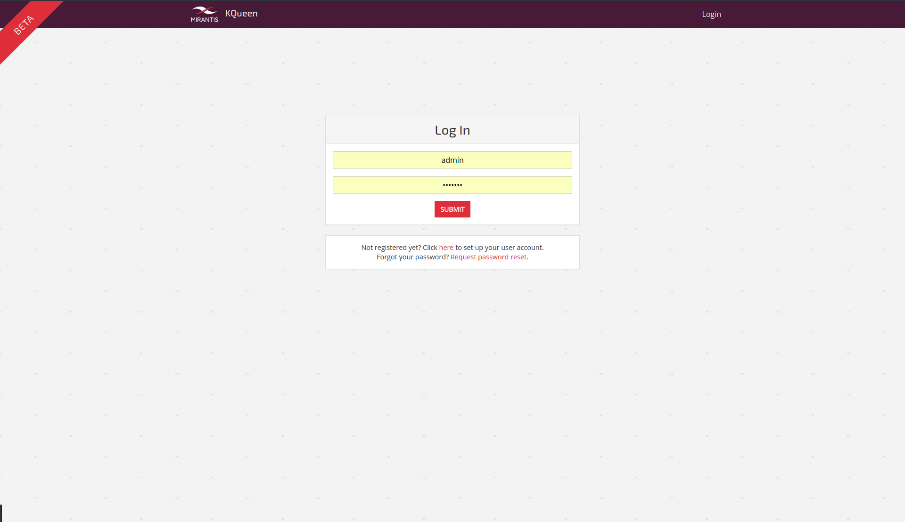

You can see overview page of fresh organization, without any running resources. Let's create some.

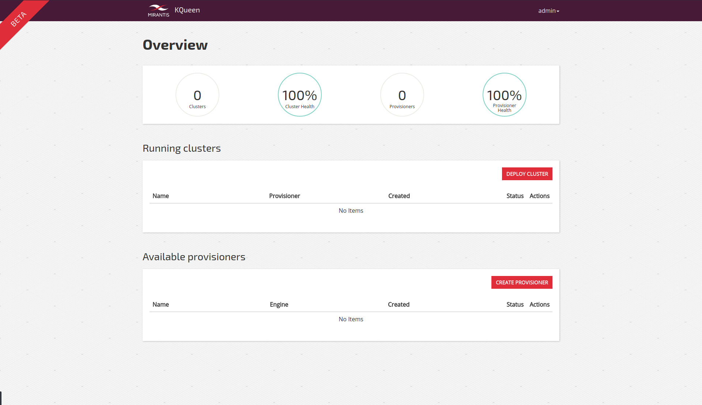

First cluster
-------------

First you need to create provisioner instance, which represents single endpoint in specific backend e.g. single GCE project or single AKS tenant. You can provision all your Kubernetes clusters through this provisioner instance or you can create another one for different project/tenant in the same backend and/or another backend.

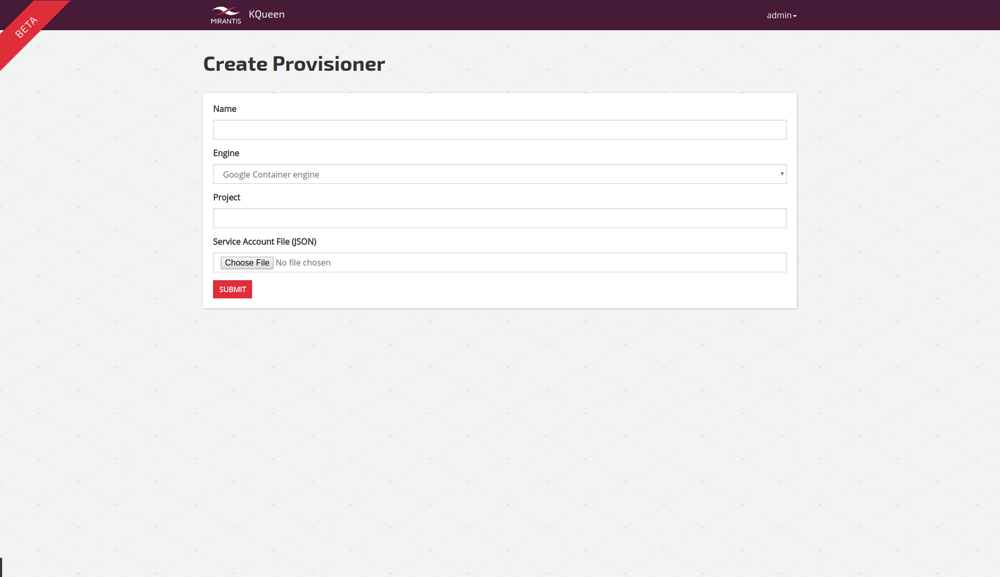

After you provide the necessary informations and submit the form, you can see your provisioner on the overview screen, provisioner status represents the availability of the backend at the time of provisioner creation.

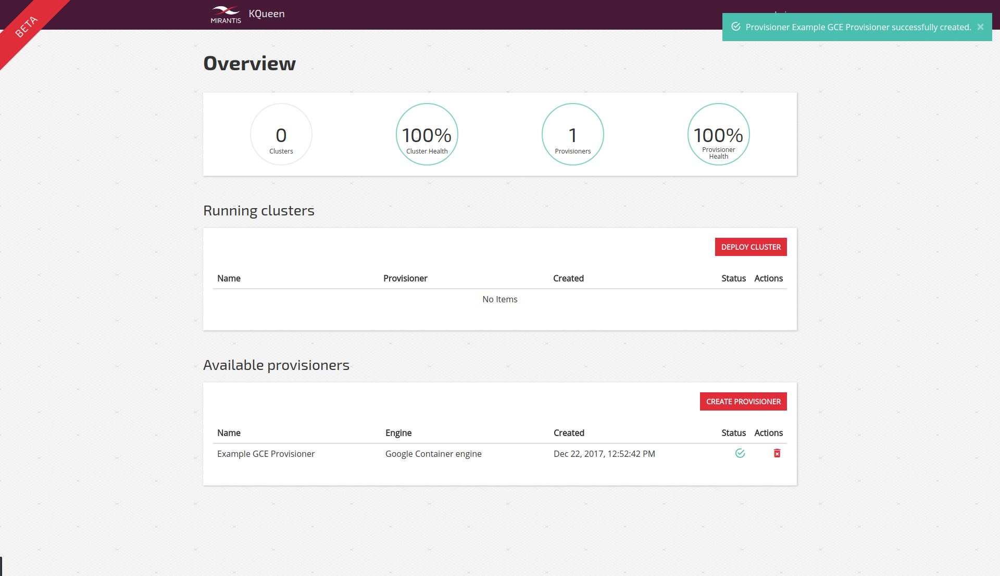

Now we are set for deploying clusters to the selected backend. On the Cluster Deploy screen you need to select your existing provisioner and fill in parameters specific for backend implemented by your provisioner.

.. figure:: screenshots/kqueen_deploy_cluster.png
   :scale: 100 %
   :alt: cluster deploy

After you submit the form, you can see your new cluster on the overview page in the "Deploying" state.

Review your cluster
-------------------

You can check the cluster detail page for more informations about your workload. Right after the deployment you need to wait before the cluster is provisioned to the backend.

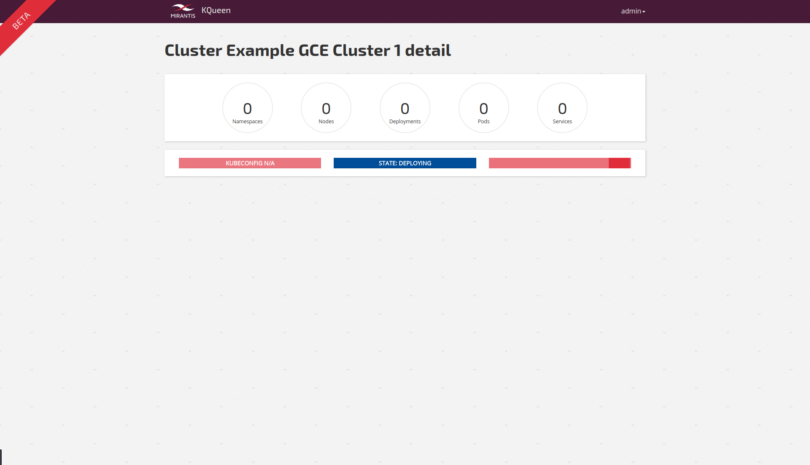

Then you can see all your running deployments, pods and services as well as images and volumes in the Status tab of this detail page. In the Topology tab you can see your resources in graph visualization of your choice.

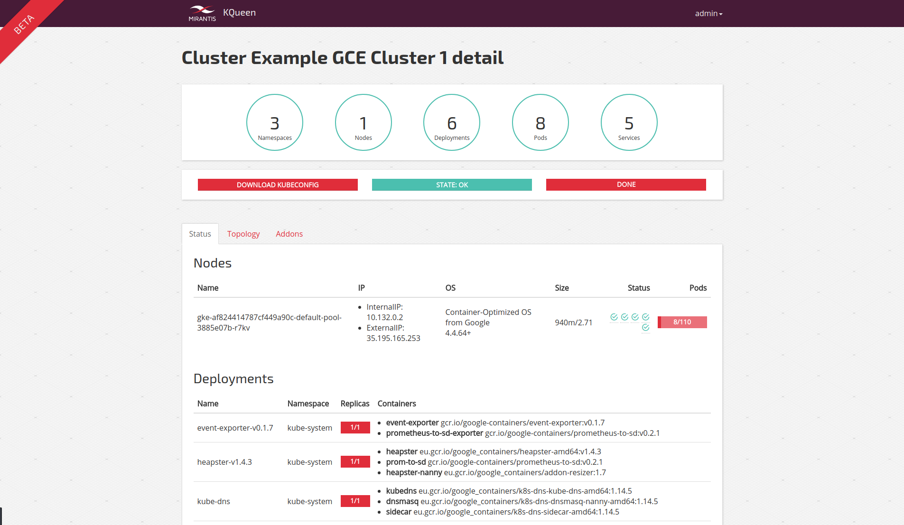

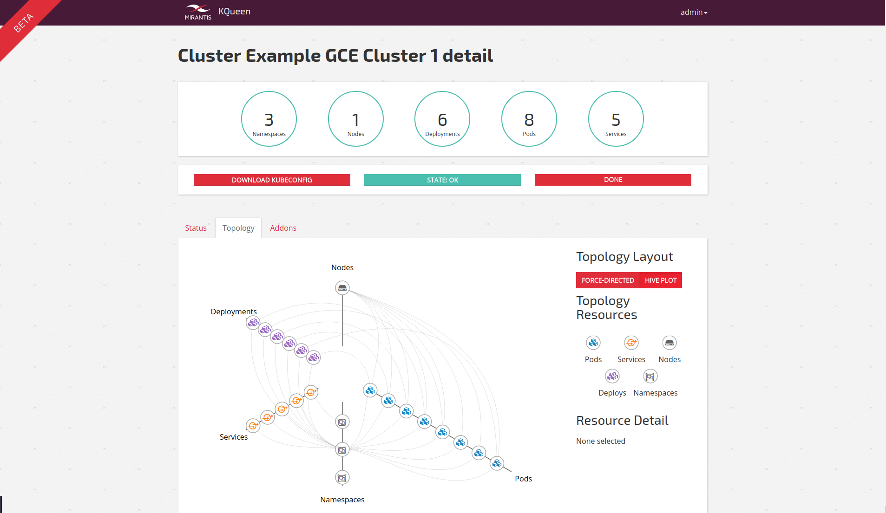

Manage users in your Organization
---------------------------------

You can review your organization from the Manage Organization page.

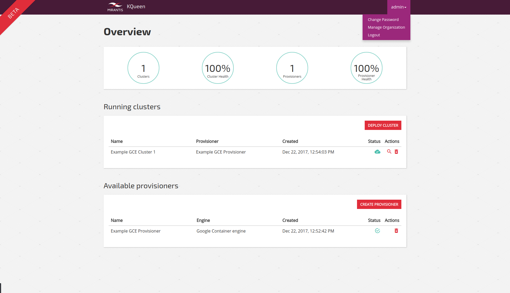

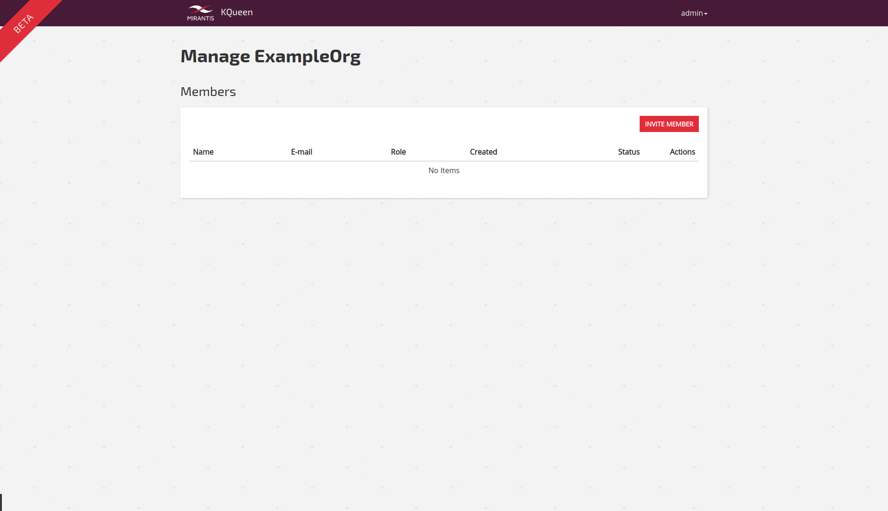

Admin user can invite more users to his organization as member users. Just hit the Invite Member button and fill in new members e-mail address.

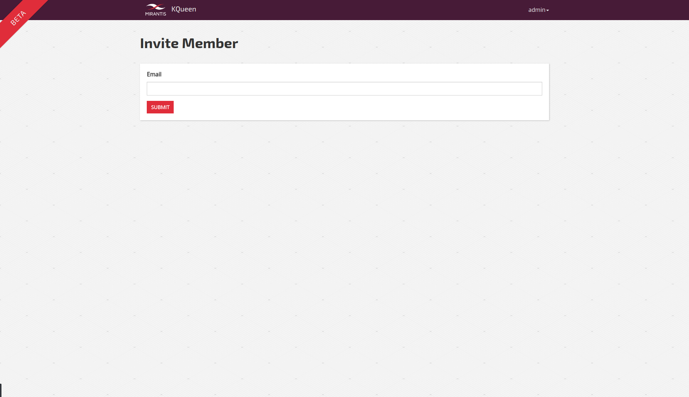

New members are considered inactive until they set their password via link provided in the e-mail. This e-mail can be resent with the Resend invitation button next to the respective user if needed.

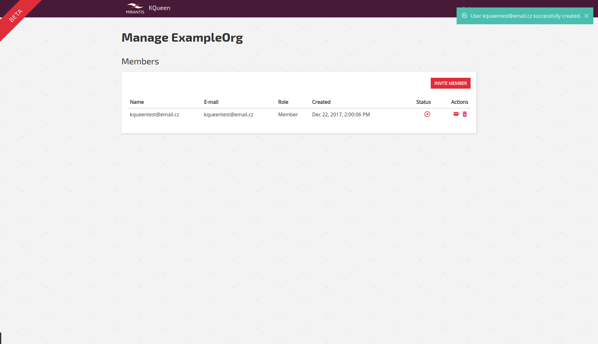

After they set their password, new users are considered active and can log into the application.

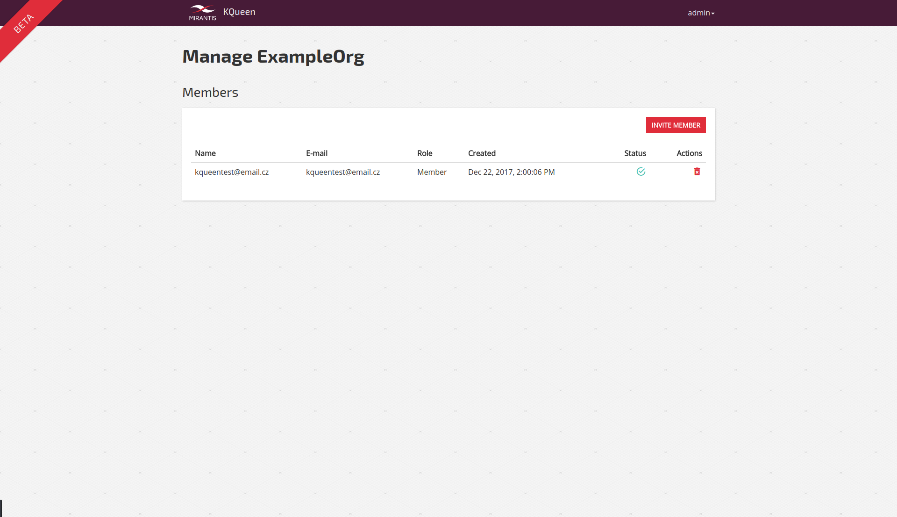
